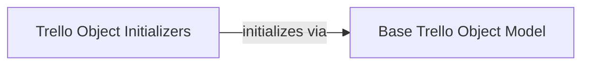

## Component Details

This graph illustrates the core components of the Trello object model, focusing on the foundational `Base Trello Object Model` and how various Trello entity initializers (`Trello Object Initializers`) leverage this base for consistent object creation.

### Base Trello Object Model
A foundational component providing common attributes and methods inherited by most Trello entity classes, ensuring consistent initialization and basic functionalities across different Trello objects.

**Related Classes/Methods**:

- <a href="https://github.com/sarumont/py-trello/blob/master/trello/base.py#L4-L15" target="_blank" rel="noopener noreferrer">`trello.base.TrelloBase` (4:15)</a>

### Trello Object Initializers
This component encompasses the initialization methods of various Trello-specific objects such as Custom Fields, Checklists, Stars, Members, Boards, Organizations, Labels, Cards, Attachments, Lists, and Power-Ups. These initializers all delegate to the TrelloBase component for common base initialization.

**Related Classes/Methods**:

- <a href="https://github.com/sarumont/py-trello/blob/master/trello/customfield.py#L18-L24" target="_blank" rel="noopener noreferrer">`trello.customfield.CustomFieldDefinition:__init__` (18:24)</a>
- <a href="https://github.com/sarumont/py-trello/blob/master/trello/customfield.py#L62-L68" target="_blank" rel="noopener noreferrer">`trello.customfield.CustomField:__init__` (62:68)</a>
- <a href="https://github.com/sarumont/py-trello/blob/master/trello/checklist.py#L13-L26" target="_blank" rel="noopener noreferrer">`trello.checklist.Checklist:__init__` (13:26)</a>
- <a href="https://github.com/sarumont/py-trello/blob/master/trello/star.py#L12-L16" target="_blank" rel="noopener noreferrer">`trello.star.Star:__init__` (12:16)</a>
- <a href="https://github.com/sarumont/py-trello/blob/master/trello/member.py#L13-L17" target="_blank" rel="noopener noreferrer">`trello.member.Member:__init__` (13:17)</a>
- <a href="https://github.com/sarumont/py-trello/blob/master/trello/board.py#L22-L42" target="_blank" rel="noopener noreferrer">`trello.board.Board:__init__` (22:42)</a>
- <a href="https://github.com/sarumont/py-trello/blob/master/trello/organization.py#L16-L21" target="_blank" rel="noopener noreferrer">`trello.organization.Organization:__init__` (16:21)</a>
- <a href="https://github.com/sarumont/py-trello/blob/master/trello/label.py#L12-L17" target="_blank" rel="noopener noreferrer">`trello.label.Label:__init__` (12:17)</a>
- <a href="https://github.com/sarumont/py-trello/blob/master/trello/card.py#L104-L126" target="_blank" rel="noopener noreferrer">`trello.card.Card:__init__` (104:126)</a>
- <a href="https://github.com/sarumont/py-trello/blob/master/trello/attachments.py#L11-L22" target="_blank" rel="noopener noreferrer">`trello.attachments.Attachments:__init__` (11:22)</a>
- <a href="https://github.com/sarumont/py-trello/blob/master/trello/trellolist.py#L14-L27" target="_blank" rel="noopener noreferrer">`trello.trellolist.List:__init__` (14:27)</a>
- <a href="https://github.com/sarumont/py-trello/blob/master/trello/powerup.py#L20-L32" target="_blank" rel="noopener noreferrer">`trello.powerup.PowerUp:__init__` (20:32)</a>

### [FAQ](https://github.com/CodeBoarding/GeneratedOnBoardings/tree/main?tab=readme-ov-file#faq)