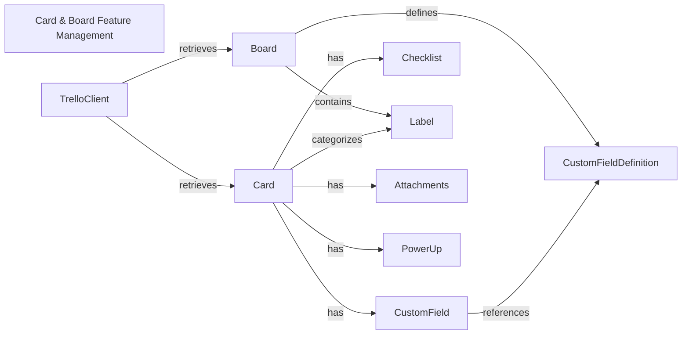

## Component Details

This subsystem, 'Card & Board Feature Management', provides comprehensive functionalities for managing various features associated with Trello cards and boards. Its main purpose is to enable the creation, modification, and retrieval of custom fields (both definitions and values), checklists, labels, attachments, and power-ups, thereby extending the core capabilities of Trello entities. The flow typically involves a `TrelloClient` interacting with `Board` and `Card` objects, which in turn manage their respective features like `CustomFieldDefinition` (on boards), `CustomField` (on cards), `Checklist`, `Label`, `Attachments`, and `PowerUp` instances.

### Card & Board Feature Management
Provides functionalities for managing various features associated with Trello cards and boards, such as custom fields (definitions and values), checklists, labels, attachments, and power-ups.

**Related Classes/Methods**:

- <a href="https://github.com/sarumont/py-trello/blob/master/trello/customfield.py#L14-L53" target="_blank" rel="noopener noreferrer">`trello.customfield.CustomFieldDefinition` (14:53)</a>
- <a href="https://github.com/sarumont/py-trello/blob/master/trello/customfield.py#L56-L132" target="_blank" rel="noopener noreferrer">`trello.customfield.CustomField` (56:132)</a>
- <a href="https://github.com/sarumont/py-trello/blob/master/trello/customfield.py#L135-L176" target="_blank" rel="noopener noreferrer">`trello.customfield.CustomFieldText` (135:176)</a>
- <a href="https://github.com/sarumont/py-trello/blob/master/trello/customfield.py#L179-L217" target="_blank" rel="noopener noreferrer">`trello.customfield.CustomFieldCheckbox` (179:217)</a>
- <a href="https://github.com/sarumont/py-trello/blob/master/trello/customfield.py#L220-L260" target="_blank" rel="noopener noreferrer">`trello.customfield.CustomFieldDate` (220:260)</a>
- <a href="https://github.com/sarumont/py-trello/blob/master/trello/customfield.py#L263-L318" target="_blank" rel="noopener noreferrer">`trello.customfield.CustomFieldList` (263:318)</a>
- <a href="https://github.com/sarumont/py-trello/blob/master/trello/customfield.py#L321-L359" target="_blank" rel="noopener noreferrer">`trello.customfield.CustomFieldNumber` (321:359)</a>
- <a href="https://github.com/sarumont/py-trello/blob/master/trello/checklist.py#L8-L184" target="_blank" rel="noopener noreferrer">`trello.checklist.Checklist` (8:184)</a>
- <a href="https://github.com/sarumont/py-trello/blob/master/trello/label.py#L8-L45" target="_blank" rel="noopener noreferrer">`trello.label.Label` (8:45)</a>
- <a href="https://github.com/sarumont/py-trello/blob/master/trello/attachments.py#L7-L40" target="_blank" rel="noopener noreferrer">`trello.attachments.Attachments` (7:40)</a>
- <a href="https://github.com/sarumont/py-trello/blob/master/trello/attachments.py#L43-L62" target="_blank" rel="noopener noreferrer">`trello.attachments.AttachmentsPreview` (43:62)</a>
- <a href="https://github.com/sarumont/py-trello/blob/master/trello/powerup.py#L15-L63" target="_blank" rel="noopener noreferrer">`trello.powerup.PowerUp` (15:63)</a>

### TrelloClient
The primary interface for authenticating with and interacting with the Trello API. It handles all HTTP requests to the Trello server, including fetching and posting JSON data, and manages OAuth authentication.

**Related Classes/Methods**:

- <a href="https://github.com/sarumont/py-trello/blob/master/trello/trelloclient.py#L29-L427" target="_blank" rel="noopener noreferrer">`trello.trelloclient.TrelloClient` (29:427)</a>
- <a href="https://github.com/sarumont/py-trello/blob/master/trello/trelloclient.py#L201-L257" target="_blank" rel="noopener noreferrer">`trello.trelloclient.TrelloClient.fetch_json` (201:257)</a>
- <a href="https://github.com/sarumont/py-trello/blob/master/trello/trelloclient.py#L75-L91" target="_blank" rel="noopener noreferrer">`trello.trelloclient.TrelloClient.list_boards` (75:91)</a>
- <a href="https://github.com/sarumont/py-trello/blob/master/trello/trelloclient.py#L120-L126" target="_blank" rel="noopener noreferrer">`trello.trelloclient.TrelloClient.get_board` (120:126)</a>
- <a href="https://github.com/sarumont/py-trello/blob/master/trello/trelloclient.py#L171-L179" target="_blank" rel="noopener noreferrer">`trello.trelloclient.TrelloClient.get_card` (171:179)</a>
- <a href="https://github.com/sarumont/py-trello/blob/master/trello/trelloclient.py#L181-L188" target="_blank" rel="noopener noreferrer">`trello.trelloclient.TrelloClient.get_list` (181:188)</a>
- <a href="https://github.com/sarumont/py-trello/blob/master/trello/trelloclient.py#L190-L199" target="_blank" rel="noopener noreferrer">`trello.trelloclient.TrelloClient.get_label` (190:199)</a>
- <a href="https://github.com/sarumont/py-trello/blob/master/trello/trelloclient.py#L312-L392" target="_blank" rel="noopener noreferrer">`trello.trelloclient.TrelloClient.search` (312:392)</a>

### Board
Represents a Trello board, which is a collection of lists and cards. It provides methods to manage lists, cards, labels, members, and custom field definitions associated with the board.

**Related Classes/Methods**:

- <a href="https://github.com/sarumont/py-trello/blob/master/trello/board.py#L15-L649" target="_blank" rel="noopener noreferrer">`trello.board.Board` (15:649)</a>
- <a href="https://github.com/sarumont/py-trello/blob/master/trello/board.py#L45-L68" target="_blank" rel="noopener noreferrer">`trello.board.Board.from_json` (45:68)</a>
- <a href="https://github.com/sarumont/py-trello/blob/master/trello/board.py#L161-L170" target="_blank" rel="noopener noreferrer">`trello.board.Board.get_lists` (161:170)</a>
- <a href="https://github.com/sarumont/py-trello/blob/master/trello/board.py#L445-L460" target="_blank" rel="noopener noreferrer">`trello.board.Board.get_cards` (445:460)</a>
- <a href="https://github.com/sarumont/py-trello/blob/master/trello/board.py#L521-L540" target="_blank" rel="noopener noreferrer">`trello.board.Board.get_members` (521:540)</a>
- <a href="https://github.com/sarumont/py-trello/blob/master/trello/board.py#L179-L187" target="_blank" rel="noopener noreferrer">`trello.board.Board.get_custom_field_definitions` (179:187)</a>
- <a href="https://github.com/sarumont/py-trello/blob/master/trello/board.py#L352-L367" target="_blank" rel="noopener noreferrer">`trello.board.Board.add_list` (352:367)</a>
- <a href="https://github.com/sarumont/py-trello/blob/master/trello/board.py#L369-L382" target="_blank" rel="noopener noreferrer">`trello.board.Board.add_label` (369:382)</a>

### Card
Represents a Trello card, the fundamental unit of work in Trello. It holds details like name, description, due date, and can have custom fields, comments, checklists, and attachments. It provides methods to modify its properties and interact with its associated elements.

**Related Classes/Methods**:

- <a href="https://github.com/sarumont/py-trello/blob/master/trello/card.py#L19-L819" target="_blank" rel="noopener noreferrer">`trello.card.Card` (19:819)</a>
- <a href="https://github.com/sarumont/py-trello/blob/master/trello/card.py#L129-L169" target="_blank" rel="noopener noreferrer">`trello.card.Card.from_json` (129:169)</a>
- <a href="https://github.com/sarumont/py-trello/blob/master/trello/card.py#L209-L218" target="_blank" rel="noopener noreferrer">`trello.card.Card.fetch_custom_fields` (209:218)</a>
- <a href="https://github.com/sarumont/py-trello/blob/master/trello/card.py#L220-L231" target="_blank" rel="noopener noreferrer">`trello.card.Card.fetch_comments` (220:231)</a>
- <a href="https://github.com/sarumont/py-trello/blob/master/trello/card.py#L243-L257" target="_blank" rel="noopener noreferrer">`trello.card.Card.fetch_checklists` (243:257)</a>
- <a href="https://github.com/sarumont/py-trello/blob/master/trello/card.py#L691-L713" target="_blank" rel="noopener noreferrer">`trello.card.Card.attach` (691:713)</a>
- <a href="https://github.com/sarumont/py-trello/blob/master/trello/card.py#L746-L771" target="_blank" rel="noopener noreferrer">`trello.card.Card.add_checklist` (746:771)</a>
- <a href="https://github.com/sarumont/py-trello/blob/master/trello/card.py#L512-L518" target="_blank" rel="noopener noreferrer">`trello.card.Card.set_name` (512:518)</a>
- <a href="https://github.com/sarumont/py-trello/blob/master/trello/card.py#L520-L522" target="_blank" rel="noopener noreferrer">`trello.card.Card.set_description` (520:522)</a>
- <a href="https://github.com/sarumont/py-trello/blob/master/trello/card.py#L524-L531" target="_blank" rel="noopener noreferrer">`trello.card.Card.set_due` (524:531)</a>

### CustomFieldDefinition
Defines the schema and options for a custom field that can be applied to cards on a specific board.

**Related Classes/Methods**:

- <a href="https://github.com/sarumont/py-trello/blob/master/trello/customfield.py#L14-L53" target="_blank" rel="noopener noreferrer">`trello.customfield.CustomFieldDefinition` (14:53)</a>
- <a href="https://github.com/sarumont/py-trello/blob/master/trello/customfield.py#L27-L46" target="_blank" rel="noopener noreferrer">`trello.customfield.CustomFieldDefinition.from_json` (27:46)</a>
- <a href="https://github.com/sarumont/py-trello/blob/master/trello/customfield.py#L49-L50" target="_blank" rel="noopener noreferrer">`trello.customfield.CustomFieldDefinition.from_json_list` (49:50)</a>

### CustomField
Represents the actual data value for a custom field on a specific Trello card. This is an abstract base class with concrete implementations for different field types (Text, Checkbox, Date, List, Number).

**Related Classes/Methods**:

- <a href="https://github.com/sarumont/py-trello/blob/master/trello/customfield.py#L56-L132" target="_blank" rel="noopener noreferrer">`trello.customfield.CustomField` (56:132)</a>
- <a href="https://github.com/sarumont/py-trello/blob/master/trello/customfield.py#L135-L176" target="_blank" rel="noopener noreferrer">`trello.customfield.CustomFieldText` (135:176)</a>
- <a href="https://github.com/sarumont/py-trello/blob/master/trello/customfield.py#L179-L217" target="_blank" rel="noopener noreferrer">`trello.customfield.CustomFieldCheckbox` (179:217)</a>
- <a href="https://github.com/sarumont/py-trello/blob/master/trello/customfield.py#L220-L260" target="_blank" rel="noopener noreferrer">`trello.customfield.CustomFieldDate` (220:260)</a>
- <a href="https://github.com/sarumont/py-trello/blob/master/trello/customfield.py#L263-L318" target="_blank" rel="noopener noreferrer">`trello.customfield.CustomFieldList` (263:318)</a>
- <a href="https://github.com/sarumont/py-trello/blob/master/trello/customfield.py#L321-L359" target="_blank" rel="noopener noreferrer">`trello.customfield.CustomFieldNumber` (321:359)</a>

### Checklist
Manages a list of items associated with a Trello card, allowing users to track sub-tasks or steps.

**Related Classes/Methods**:

- <a href="https://github.com/sarumont/py-trello/blob/master/trello/checklist.py#L8-L184" target="_blank" rel="noopener noreferrer">`trello.checklist.Checklist` (8:184)</a>
- <a href="https://github.com/sarumont/py-trello/blob/master/trello/checklist.py#L28-L41" target="_blank" rel="noopener noreferrer">`trello.checklist.Checklist.add_checklist_item` (28:41)</a>
- <a href="https://github.com/sarumont/py-trello/blob/master/trello/checklist.py#L43-L56" target="_blank" rel="noopener noreferrer">`trello.checklist.Checklist.delete_checklist_item` (43:56)</a>
- <a href="https://github.com/sarumont/py-trello/blob/master/trello/checklist.py#L67-L86" target="_blank" rel="noopener noreferrer">`trello.checklist.Checklist.set_checklist_item` (67:86)</a>

### Label
Provides a way to categorize and organize cards on a board using color-coded tags.

**Related Classes/Methods**:

- <a href="https://github.com/sarumont/py-trello/blob/master/trello/label.py#L8-L45" target="_blank" rel="noopener noreferrer">`trello.label.Label` (8:45)</a>
- <a href="https://github.com/sarumont/py-trello/blob/master/trello/label.py#L20-L31" target="_blank" rel="noopener noreferrer">`trello.label.Label.from_json` (20:31)</a>
- <a href="https://github.com/sarumont/py-trello/blob/master/trello/label.py#L34-L35" target="_blank" rel="noopener noreferrer">`trello.label.Label.from_json_list` (34:35)</a>

### Attachments
Manages attachments associated with Trello cards, including their details and previews.

**Related Classes/Methods**:

- <a href="https://github.com/sarumont/py-trello/blob/master/trello/attachments.py#L7-L40" target="_blank" rel="noopener noreferrer">`trello.attachments.Attachments` (7:40)</a>
- <a href="https://github.com/sarumont/py-trello/blob/master/trello/attachments.py#L43-L62" target="_blank" rel="noopener noreferrer">`trello.attachments.AttachmentsPreview` (43:62)</a>

### PowerUp
Represents a Trello Power-Up, which extends the functionality of boards and cards.

**Related Classes/Methods**:

- <a href="https://github.com/sarumont/py-trello/blob/master/trello/powerup.py#L15-L63" target="_blank" rel="noopener noreferrer">`trello.powerup.PowerUp` (15:63)</a>

### [FAQ](https://github.com/CodeBoarding/GeneratedOnBoardings/tree/main?tab=readme-ov-file#faq)