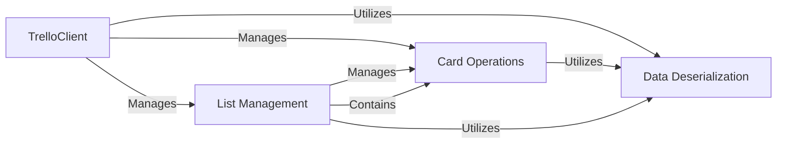

## Component Details

The Card & List Management subsystem is responsible for handling all operations related to Trello cards and lists. This includes fetching detailed information about cards, managing their attachments, checklists, comments, and custom fields, as well as performing actions like adding, moving, and retrieving cards within lists. It interacts with the Trello API through a central client and relies on a data deserialization component to convert raw API responses into structured Python objects.

### Card Operations
This component manages various operations on Trello cards, including fetching detailed information like custom fields, comments, checklists, plugin data, and attachments. It also handles setting card attributes and managing card movements.

**Related Classes/Methods**:

- <a href="https://github.com/sarumont/py-trello/blob/master/trello/card.py#L19-L819" target="_blank" rel="noopener noreferrer">`trello.card.Card` (19:819)</a>
- <a href="https://github.com/sarumont/py-trello/blob/master/trello/card.py#L60-L66" target="_blank" rel="noopener noreferrer">`trello.card.Card:custom_fields` (60:66)</a>
- <a href="https://github.com/sarumont/py-trello/blob/master/trello/card.py#L69-L75" target="_blank" rel="noopener noreferrer">`trello.card.Card:comments` (69:75)</a>
- <a href="https://github.com/sarumont/py-trello/blob/master/trello/card.py#L78-L84" target="_blank" rel="noopener noreferrer">`trello.card.Card:checklists` (78:84)</a>
- <a href="https://github.com/sarumont/py-trello/blob/master/trello/card.py#L87-L93" target="_blank" rel="noopener noreferrer">`trello.card.Card:plugin_data` (87:93)</a>
- <a href="https://github.com/sarumont/py-trello/blob/master/trello/card.py#L96-L102" target="_blank" rel="noopener noreferrer">`trello.card.Card:attachments` (96:102)</a>
- <a href="https://github.com/sarumont/py-trello/blob/master/trello/card.py#L174-L207" target="_blank" rel="noopener noreferrer">`trello.card.Card:fetch` (174:207)</a>
- <a href="https://github.com/sarumont/py-trello/blob/master/trello/card.py#L209-L218" target="_blank" rel="noopener noreferrer">`trello.card.Card:fetch_custom_fields` (209:218)</a>
- <a href="https://github.com/sarumont/py-trello/blob/master/trello/card.py#L233-L235" target="_blank" rel="noopener noreferrer">`trello.card.Card:get_list` (233:235)</a>
- <a href="https://github.com/sarumont/py-trello/blob/master/trello/card.py#L237-L241" target="_blank" rel="noopener noreferrer">`trello.card.Card:get_comments` (237:241)</a>
- <a href="https://github.com/sarumont/py-trello/blob/master/trello/card.py#L243-L257" target="_blank" rel="noopener noreferrer">`trello.card.Card:fetch_checklists` (243:257)</a>
- <a href="https://github.com/sarumont/py-trello/blob/master/trello/card.py#L272-L273" target="_blank" rel="noopener noreferrer">`trello.card.Card:get_attachments` (272:273)</a>
- <a href="https://github.com/sarumont/py-trello/blob/master/trello/card.py#L294-L300" target="_blank" rel="noopener noreferrer">`trello.card.Card:attriExp` (294:300)</a>
- <a href="https://github.com/sarumont/py-trello/blob/master/trello/card.py#L315-L344" target="_blank" rel="noopener noreferrer">`trello.card.Card:_list_movements` (315:344)</a>
- <a href="https://github.com/sarumont/py-trello/blob/master/trello/card.py#L346-L353" target="_blank" rel="noopener noreferrer">`trello.card.Card:listCardMove_date` (346:353)</a>
- <a href="https://github.com/sarumont/py-trello/blob/master/trello/card.py#L355-L376" target="_blank" rel="noopener noreferrer">`trello.card.Card:list_movements` (355:376)</a>
- <a href="https://github.com/sarumont/py-trello/blob/master/trello/card.py#L378-L466" target="_blank" rel="noopener noreferrer">`trello.card.Card:get_stats_by_list` (378:466)</a>
- <a href="https://github.com/sarumont/py-trello/blob/master/trello/card.py#L469-L475" target="_blank" rel="noopener noreferrer">`trello.card.Card:latestCardMove_date` (469:475)</a>
- <a href="https://github.com/sarumont/py-trello/blob/master/trello/card.py#L512-L518" target="_blank" rel="noopener noreferrer">`trello.card.Card:set_name` (512:518)</a>
- <a href="https://github.com/sarumont/py-trello/blob/master/trello/card.py#L520-L522" target="_blank" rel="noopener noreferrer">`trello.card.Card:set_description` (520:522)</a>
- <a href="https://github.com/sarumont/py-trello/blob/master/trello/card.py#L524-L531" target="_blank" rel="noopener noreferrer">`trello.card.Card:set_due` (524:531)</a>
- <a href="https://github.com/sarumont/py-trello/blob/master/trello/card.py#L533-L540" target="_blank" rel="noopener noreferrer">`trello.card.Card:set_start` (533:540)</a>
- <a href="https://github.com/sarumont/py-trello/blob/master/trello/card.py#L542-L551" target="_blank" rel="noopener noreferrer">`trello.card.Card:set_reminder` (542:551)</a>
- <a href="https://github.com/sarumont/py-trello/blob/master/trello/card.py#L553-L558" target="_blank" rel="noopener noreferrer">`trello.card.Card:set_due_complete` (553:558)</a>
- <a href="https://github.com/sarumont/py-trello/blob/master/trello/card.py#L560-L565" target="_blank" rel="noopener noreferrer">`trello.card.Card:remove_due_complete` (560:565)</a>
- <a href="https://github.com/sarumont/py-trello/blob/master/trello/card.py#L568-L573" target="_blank" rel="noopener noreferrer">`trello.card.Card:remove_due` (568:573)</a>
- <a href="https://github.com/sarumont/py-trello/blob/master/trello/card.py#L575-L582" target="_blank" rel="noopener noreferrer">`trello.card.Card:set_pos` (575:582)</a>
- <a href="https://github.com/sarumont/py-trello/blob/master/trello/card.py#L610-L612" target="_blank" rel="noopener noreferrer">`trello.card.Card:set_closed` (610:612)</a>
- <a href="https://github.com/sarumont/py-trello/blob/master/trello/card.py#L691-L713" target="_blank" rel="noopener noreferrer">`trello.card.Card:attach` (691:713)</a>
- <a href="https://github.com/sarumont/py-trello/blob/master/trello/card.py#L746-L771" target="_blank" rel="noopener noreferrer">`trello.card.Card:add_checklist` (746:771)</a>
- <a href="https://github.com/sarumont/py-trello/blob/master/trello/card.py#L784-L788" target="_blank" rel="noopener noreferrer">`trello.card.Card._set_remote_attribute` (784:788)</a>
- <a href="https://github.com/sarumont/py-trello/blob/master/trello/card.py#L773-L782" target="_blank" rel="noopener noreferrer">`trello.card.Card._set_due_complete` (773:782)</a>
- <a href="https://github.com/sarumont/py-trello/blob/master/trello/card.py#L790-L795" target="_blank" rel="noopener noreferrer">`trello.card.Card._post_remote_data` (790:795)</a>
- <a href="https://github.com/sarumont/py-trello/blob/master/trello/card.py#L307-L313" target="_blank" rel="noopener noreferrer">`trello.card.Card._movement_as_dict` (307:313)</a>
- <a href="https://github.com/sarumont/py-trello/blob/master/trello/card.py#L275-L292" target="_blank" rel="noopener noreferrer">`trello.card.Card.fetch_actions` (275:292)</a>

### List Management
This component handles operations related to Trello lists, including listing, adding, and moving cards within or between lists, and setting the position of a list.

**Related Classes/Methods**:

- <a href="https://github.com/sarumont/py-trello/blob/master/trello/trellolist.py#L8-L230" target="_blank" rel="noopener noreferrer">`trello.trellolist.List` (8:230)</a>
- <a href="https://github.com/sarumont/py-trello/blob/master/trello/trellolist.py#L57-L67" target="_blank" rel="noopener noreferrer">`trello.trellolist.List:list_cards` (57:67)</a>
- <a href="https://github.com/sarumont/py-trello/blob/master/trello/trellolist.py#L69-L89" target="_blank" rel="noopener noreferrer">`trello.trellolist.List:list_cards_iter` (69:89)</a>
- <a href="https://github.com/sarumont/py-trello/blob/master/trello/trellolist.py#L91-L131" target="_blank" rel="noopener noreferrer">`trello.trellolist.List:add_card` (91:131)</a>
- <a href="https://github.com/sarumont/py-trello/blob/master/trello/trellolist.py#L192-L199" target="_blank" rel="noopener noreferrer">`trello.trellolist.List:move_to_board` (192:199)</a>
- <a href="https://github.com/sarumont/py-trello/blob/master/trello/trellolist.py#L217-L218" target="_blank" rel="noopener noreferrer">`trello.trellolist.List:cardsCnt` (217:218)</a>
- <a href="https://github.com/sarumont/py-trello/blob/master/trello/trellolist.py#L229-L230" target="_blank" rel="noopener noreferrer">`trello.trellolist.List:set_pos` (229:230)</a>
- <a href="https://github.com/sarumont/py-trello/blob/master/trello/trellolist.py#L184-L189" target="_blank" rel="noopener noreferrer">`trello.trellolist.List.move` (184:189)</a>

### TrelloClient
The main client for interacting with the Trello API. It handles fetching raw JSON data and provides methods to retrieve various Trello entities like cards, lists, and boards, and perform searches.

**Related Classes/Methods**:

- <a href="https://github.com/sarumont/py-trello/blob/master/trello/trelloclient.py#L29-L427" target="_blank" rel="noopener noreferrer">`trello.trelloclient.TrelloClient` (29:427)</a>
- <a href="https://github.com/sarumont/py-trello/blob/master/trello/trelloclient.py#L201-L257" target="_blank" rel="noopener noreferrer">`trello.trelloclient.TrelloClient.fetch_json` (201:257)</a>
- <a href="https://github.com/sarumont/py-trello/blob/master/trello/trelloclient.py#L171-L179" target="_blank" rel="noopener noreferrer">`trello.trelloclient.TrelloClient.get_card` (171:179)</a>
- <a href="https://github.com/sarumont/py-trello/blob/master/trello/trelloclient.py#L181-L188" target="_blank" rel="noopener noreferrer">`trello.trelloclient.TrelloClient.get_list` (181:188)</a>
- <a href="https://github.com/sarumont/py-trello/blob/master/trello/trelloclient.py#L120-L126" target="_blank" rel="noopener noreferrer">`trello.trelloclient.TrelloClient.get_board` (120:126)</a>
- <a href="https://github.com/sarumont/py-trello/blob/master/trello/trelloclient.py#L312-L392" target="_blank" rel="noopener noreferrer">`trello.trelloclient.TrelloClient.search` (312:392)</a>

### Data Deserialization
This component is responsible for converting raw JSON data received from the Trello API into structured Python objects representing Trello entities like Boards, Cards, Lists, Members, Organizations, Labels, Custom Fields, Checklists, and Attachments.

**Related Classes/Methods**:

- <a href="https://github.com/sarumont/py-trello/blob/master/trello/trellolist.py#L30-L43" target="_blank" rel="noopener noreferrer">`trello.trellolist.List.from_json` (30:43)</a>
- <a href="https://github.com/sarumont/py-trello/blob/master/trello/card.py#L129-L169" target="_blank" rel="noopener noreferrer">`trello.card.Card.from_json` (129:169)</a>
- <a href="https://github.com/sarumont/py-trello/blob/master/trello/board.py#L45-L68" target="_blank" rel="noopener noreferrer">`trello.board.Board.from_json` (45:68)</a>
- <a href="https://github.com/sarumont/py-trello/blob/master/trello/member.py#L75-L91" target="_blank" rel="noopener noreferrer">`trello.member.Member.from_json` (75:91)</a>
- <a href="https://github.com/sarumont/py-trello/blob/master/trello/organization.py#L24-L35" target="_blank" rel="noopener noreferrer">`trello.organization.Organization.from_json` (24:35)</a>
- <a href="https://github.com/sarumont/py-trello/blob/master/trello/label.py#L34-L35" target="_blank" rel="noopener noreferrer">`trello.label.Label.from_json_list` (34:35)</a>
- <a href="https://github.com/sarumont/py-trello/blob/master/trello/customfield.py#L120-L121" target="_blank" rel="noopener noreferrer">`trello.customfield.CustomField.from_json_list` (120:121)</a>
- <a href="https://github.com/sarumont/py-trello/blob/master/trello/checklist.py#L8-L184" target="_blank" rel="noopener noreferrer">`trello.checklist.Checklist` (8:184)</a>
- <a href="https://github.com/sarumont/py-trello/blob/master/trello/attachments.py#L25-L37" target="_blank" rel="noopener noreferrer">`trello.attachments.Attachments.from_json` (25:37)</a>
- <a href="https://github.com/sarumont/py-trello/blob/master/trello/card.py#L19-L819" target="_blank" rel="noopener noreferrer">`trello.card.Card` (19:819)</a>
- <a href="https://github.com/sarumont/py-trello/blob/master/trello/trellolist.py#L8-L230" target="_blank" rel="noopener noreferrer">`trello.trellolist.List` (8:230)</a>

### [FAQ](https://github.com/CodeBoarding/GeneratedOnBoardings/tree/main?tab=readme-ov-file#faq)