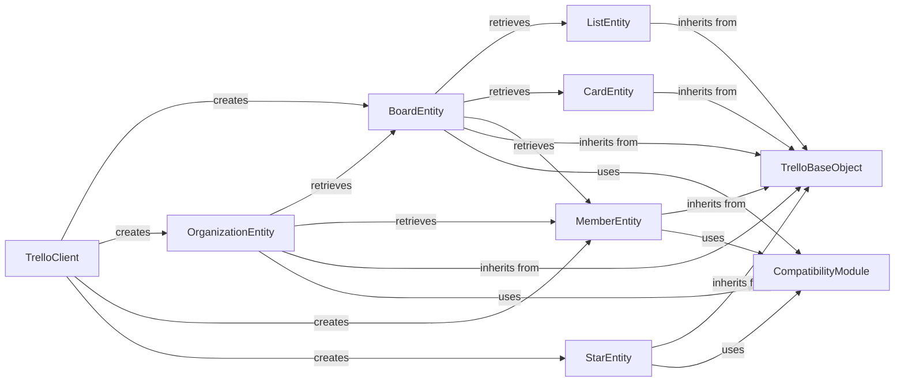

## Component Details

Manages high-level Trello entities such as boards, organizations, and members, including operations for retrieving, creating, and updating their details, and listing their associated components.

### TrelloClient
The primary interface for interacting with the Trello API, responsible for making requests and orchestrating the creation of various Trello objects.

**Related Classes/Methods**:

- <a href="https://github.com/sarumont/py-trello/blob/master/trello/trelloclient.py#L29-L427" target="_blank" rel="noopener noreferrer">`trello.trelloclient.TrelloClient` (29:427)</a>
- <a href="https://github.com/sarumont/py-trello/blob/master/trello/trelloclient.py#L75-L91" target="_blank" rel="noopener noreferrer">`trello.trelloclient.TrelloClient.list_boards` (75:91)</a>
- <a href="https://github.com/sarumont/py-trello/blob/master/trello/trelloclient.py#L93-L109" target="_blank" rel="noopener noreferrer">`trello.trelloclient.TrelloClient.list_organizations` (93:109)</a>
- <a href="https://github.com/sarumont/py-trello/blob/master/trello/trelloclient.py#L111-L118" target="_blank" rel="noopener noreferrer">`trello.trelloclient.TrelloClient.get_organization` (111:118)</a>
- <a href="https://github.com/sarumont/py-trello/blob/master/trello/trelloclient.py#L120-L126" target="_blank" rel="noopener noreferrer">`trello.trelloclient.TrelloClient.get_board` (120:126)</a>
- <a href="https://github.com/sarumont/py-trello/blob/master/trello/trelloclient.py#L128-L142" target="_blank" rel="noopener noreferrer">`trello.trelloclient.TrelloClient.add_organization` (128:142)</a>
- <a href="https://github.com/sarumont/py-trello/blob/master/trello/trelloclient.py#L144-L162" target="_blank" rel="noopener noreferrer">`trello.trelloclient.TrelloClient.add_board` (144:162)</a>
- <a href="https://github.com/sarumont/py-trello/blob/master/trello/trelloclient.py#L164-L169" target="_blank" rel="noopener noreferrer">`trello.trelloclient.TrelloClient.get_member` (164:169)</a>
- <a href="https://github.com/sarumont/py-trello/blob/master/trello/trelloclient.py#L312-L392" target="_blank" rel="noopener noreferrer">`trello.trelloclient.TrelloClient.search` (312:392)</a>
- <a href="https://github.com/sarumont/py-trello/blob/master/trello/trelloclient.py#L394-L407" target="_blank" rel="noopener noreferrer">`trello.trelloclient.TrelloClient.list_stars` (394:407)</a>
- <a href="https://github.com/sarumont/py-trello/blob/master/trello/trelloclient.py#L409-L418" target="_blank" rel="noopener noreferrer">`trello.trelloclient.TrelloClient.add_star` (409:418)</a>
- <a href="https://github.com/sarumont/py-trello/blob/master/trello/trelloclient.py#L420-L427" target="_blank" rel="noopener noreferrer">`trello.trelloclient.TrelloClient.delete_star` (420:427)</a>
- <a href="https://github.com/sarumont/py-trello/blob/master/trello/trelloclient.py#L201-L257" target="_blank" rel="noopener noreferrer">`trello.trelloclient.TrelloClient.fetch_json` (201:257)</a>

### TrelloBaseObject
A foundational class providing common attributes and initialization for various Trello entities, ensuring consistent behavior across different Trello object types.

**Related Classes/Methods**:

- <a href="https://github.com/sarumont/py-trello/blob/master/trello/base.py#L4-L15" target="_blank" rel="noopener noreferrer">`trello.base.TrelloBase` (4:15)</a>
- <a href="https://github.com/sarumont/py-trello/blob/master/trello/base.py#L5-L6" target="_blank" rel="noopener noreferrer">`trello.base.TrelloBase.__init__` (5:6)</a>

### BoardEntity
Represents a Trello board, encapsulating its properties and providing methods to manage its associated lists, cards, and members.

**Related Classes/Methods**:

- <a href="https://github.com/sarumont/py-trello/blob/master/trello/board.py#L15-L649" target="_blank" rel="noopener noreferrer">`trello.board.Board` (15:649)</a>
- <a href="https://github.com/sarumont/py-trello/blob/master/trello/board.py#L22-L42" target="_blank" rel="noopener noreferrer">`trello.board.Board.__init__` (22:42)</a>
- <a href="https://github.com/sarumont/py-trello/blob/master/trello/board.py#L45-L68" target="_blank" rel="noopener noreferrer">`trello.board.Board.from_json` (45:68)</a>
- <a href="https://github.com/sarumont/py-trello/blob/master/trello/board.py#L70-L71" target="_blank" rel="noopener noreferrer">`trello.board.Board.__repr__` (70:71)</a>
- <a href="https://github.com/sarumont/py-trello/blob/master/trello/board.py#L83-L90" target="_blank" rel="noopener noreferrer">`trello.board.Board.save` (83:90)</a>
- <a href="https://github.com/sarumont/py-trello/blob/master/trello/board.py#L140-L145" target="_blank" rel="noopener noreferrer">`trello.board.Board.all_lists` (140:145)</a>
- <a href="https://github.com/sarumont/py-trello/blob/master/trello/board.py#L147-L152" target="_blank" rel="noopener noreferrer">`trello.board.Board.open_lists` (147:152)</a>
- <a href="https://github.com/sarumont/py-trello/blob/master/trello/board.py#L154-L159" target="_blank" rel="noopener noreferrer">`trello.board.Board.closed_lists` (154:159)</a>
- <a href="https://github.com/sarumont/py-trello/blob/master/trello/board.py#L161-L170" target="_blank" rel="noopener noreferrer">`trello.board.Board.get_lists` (161:170)</a>
- <a href="https://github.com/sarumont/py-trello/blob/master/trello/board.py#L172-L177" target="_blank" rel="noopener noreferrer">`trello.board.Board.list_lists` (172:177)</a>
- <a href="https://github.com/sarumont/py-trello/blob/master/trello/board.py#L397-L407" target="_blank" rel="noopener noreferrer">`trello.board.Board.all_cards` (397:407)</a>
- <a href="https://github.com/sarumont/py-trello/blob/master/trello/board.py#L409-L419" target="_blank" rel="noopener noreferrer">`trello.board.Board.open_cards` (409:419)</a>
- <a href="https://github.com/sarumont/py-trello/blob/master/trello/board.py#L421-L431" target="_blank" rel="noopener noreferrer">`trello.board.Board.closed_cards` (421:431)</a>
- <a href="https://github.com/sarumont/py-trello/blob/master/trello/board.py#L433-L443" target="_blank" rel="noopener noreferrer">`trello.board.Board.visible_cards` (433:443)</a>
- <a href="https://github.com/sarumont/py-trello/blob/master/trello/board.py#L445-L460" target="_blank" rel="noopener noreferrer">`trello.board.Board.get_cards` (445:460)</a>
- <a href="https://github.com/sarumont/py-trello/blob/master/trello/board.py#L477-L486" target="_blank" rel="noopener noreferrer">`trello.board.Board.all_members` (477:486)</a>
- <a href="https://github.com/sarumont/py-trello/blob/master/trello/board.py#L488-L497" target="_blank" rel="noopener noreferrer">`trello.board.Board.normal_members` (488:497)</a>
- <a href="https://github.com/sarumont/py-trello/blob/master/trello/board.py#L499-L508" target="_blank" rel="noopener noreferrer">`trello.board.Board.admin_members` (499:508)</a>
- <a href="https://github.com/sarumont/py-trello/blob/master/trello/board.py#L510-L519" target="_blank" rel="noopener noreferrer">`trello.board.Board.owner_members` (510:519)</a>
- <a href="https://github.com/sarumont/py-trello/blob/master/trello/board.py#L521-L540" target="_blank" rel="noopener noreferrer">`trello.board.Board.get_members` (521:540)</a>

### MemberEntity
Represents a Trello member, providing access to their profile information and associated boards.

**Related Classes/Methods**:

- <a href="https://github.com/sarumont/py-trello/blob/master/trello/member.py#L8-L91" target="_blank" rel="noopener noreferrer">`trello.member.Member` (8:91)</a>
- <a href="https://github.com/sarumont/py-trello/blob/master/trello/member.py#L13-L17" target="_blank" rel="noopener noreferrer">`trello.member.Member.__init__` (13:17)</a>
- <a href="https://github.com/sarumont/py-trello/blob/master/trello/member.py#L19-L20" target="_blank" rel="noopener noreferrer">`trello.member.Member.__repr__` (19:20)</a>
- <a href="https://github.com/sarumont/py-trello/blob/master/trello/member.py#L61-L72" target="_blank" rel="noopener noreferrer">`trello.member.Member.get_boards` (61:72)</a>
- <a href="https://github.com/sarumont/py-trello/blob/master/trello/member.py#L75-L91" target="_blank" rel="noopener noreferrer">`trello.member.Member.from_json` (75:91)</a>
- <a href="https://github.com/sarumont/py-trello/blob/master/trello/member.py#L22-L37" target="_blank" rel="noopener noreferrer">`trello.member.Member.fetch` (22:37)</a>

### OrganizationEntity
Represents a Trello organization, allowing management and retrieval of its boards and members.

**Related Classes/Methods**:

- <a href="https://github.com/sarumont/py-trello/blob/master/trello/organization.py#L9-L94" target="_blank" rel="noopener noreferrer">`trello.organization.Organization` (9:94)</a>
- <a href="https://github.com/sarumont/py-trello/blob/master/trello/organization.py#L16-L21" target="_blank" rel="noopener noreferrer">`trello.organization.Organization.__init__` (16:21)</a>
- <a href="https://github.com/sarumont/py-trello/blob/master/trello/organization.py#L24-L35" target="_blank" rel="noopener noreferrer">`trello.organization.Organization.from_json` (24:35)</a>
- <a href="https://github.com/sarumont/py-trello/blob/master/trello/organization.py#L37-L38" target="_blank" rel="noopener noreferrer">`trello.organization.Organization.__repr__` (37:38)</a>
- <a href="https://github.com/sarumont/py-trello/blob/master/trello/organization.py#L47-L49" target="_blank" rel="noopener noreferrer">`trello.organization.Organization.all_boards` (47:49)</a>
- <a href="https://github.com/sarumont/py-trello/blob/master/trello/organization.py#L51-L60" target="_blank" rel="noopener noreferrer">`trello.organization.Organization.get_boards` (51:60)</a>
- <a href="https://github.com/sarumont/py-trello/blob/master/trello/organization.py#L62-L71" target="_blank" rel="noopener noreferrer">`trello.organization.Organization.get_board` (62:71)</a>
- <a href="https://github.com/sarumont/py-trello/blob/master/trello/organization.py#L73-L78" target="_blank" rel="noopener noreferrer">`trello.organization.Organization.get_members` (73:78)</a>

### StarEntity
Represents a starred item in Trello, typically a board or card, allowing for its creation and listing.

**Related Classes/Methods**:

- <a href="https://github.com/sarumont/py-trello/blob/master/trello/star.py#L8-L40" target="_blank" rel="noopener noreferrer">`trello.star.Star` (8:40)</a>
- <a href="https://github.com/sarumont/py-trello/blob/master/trello/star.py#L12-L16" target="_blank" rel="noopener noreferrer">`trello.star.Star.__init__` (12:16)</a>
- <a href="https://github.com/sarumont/py-trello/blob/master/trello/star.py#L19-L27" target="_blank" rel="noopener noreferrer">`trello.star.Star.from_json` (19:27)</a>
- <a href="https://github.com/sarumont/py-trello/blob/master/trello/star.py#L30-L31" target="_blank" rel="noopener noreferrer">`trello.star.Star.from_json_list` (30:31)</a>
- <a href="https://github.com/sarumont/py-trello/blob/master/trello/star.py#L33-L34" target="_blank" rel="noopener noreferrer">`trello.star.Star.__repr__` (33:34)</a>

### ListEntity
Represents a Trello list, primarily responsible for its instantiation from JSON data.

**Related Classes/Methods**:

- <a href="https://github.com/sarumont/py-trello/blob/master/trello/trellolist.py#L8-L230" target="_blank" rel="noopener noreferrer">`trello.trellolist.List` (8:230)</a>
- <a href="https://github.com/sarumont/py-trello/blob/master/trello/trellolist.py#L30-L43" target="_blank" rel="noopener noreferrer">`trello.trellolist.List.from_json` (30:43)</a>

### CardEntity
Represents a Trello card, primarily responsible for its instantiation from JSON data.

**Related Classes/Methods**:

- <a href="https://github.com/sarumont/py-trello/blob/master/trello/card.py#L19-L819" target="_blank" rel="noopener noreferrer">`trello.card.Card` (19:819)</a>
- <a href="https://github.com/sarumont/py-trello/blob/master/trello/card.py#L129-L169" target="_blank" rel="noopener noreferrer">`trello.card.Card.from_json` (129:169)</a>

### CompatibilityModule
Provides utility functions to ensure compatibility, particularly for string encoding and decoding across different environments.

**Related Classes/Methods**:

- <a href="https://github.com/sarumont/py-trello/blob/master/trello/compat.py#L6-L15" target="_blank" rel="noopener noreferrer">`trello.compat.force_str` (6:15)</a>

### [FAQ](https://github.com/CodeBoarding/GeneratedOnBoardings/tree/main?tab=readme-ov-file#faq)