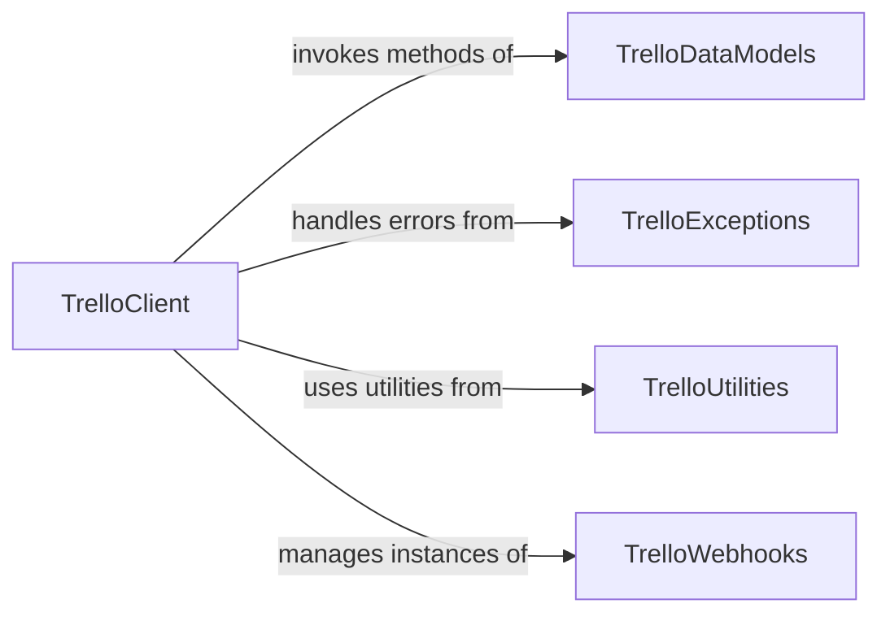

## Component Details

This system provides a Python client for interacting with the Trello API. The main flow involves the `TrelloClient` component authenticating and making various API requests to manage Trello entities. It leverages `TrelloDataModels` for structured data representation, `TrelloUtilities` for helper functions like user agent generation and OAuth token creation, and `TrelloExceptions` for robust error handling. Additionally, it interacts with `TrelloWebhooks` to manage real-time updates from Trello.

### TrelloClient
The central component for authenticating with the Trello API, making HTTP requests, handling responses, and managing general API interactions. It includes methods for listing, retrieving, adding, and deleting various Trello entities like boards, organizations, members, cards, lists, labels, and stars, as well as managing webhooks and performing searches.

**Related Classes/Methods**:

- <a href="https://github.com/sarumont/py-trello/blob/master/trello/trelloclient.py#L29-L427" target="_blank" rel="noopener noreferrer">`trello.trelloclient.TrelloClient` (29:427)</a>
- <a href="https://github.com/sarumont/py-trello/blob/master/trello/trelloclient.py#L58-L68" target="_blank" rel="noopener noreferrer">`trello.trelloclient.TrelloClient:info_for_all_boards` (58:68)</a>
- <a href="https://github.com/sarumont/py-trello/blob/master/trello/trelloclient.py#L75-L91" target="_blank" rel="noopener noreferrer">`trello.trelloclient.TrelloClient:list_boards` (75:91)</a>
- <a href="https://github.com/sarumont/py-trello/blob/master/trello/trelloclient.py#L93-L109" target="_blank" rel="noopener noreferrer">`trello.trelloclient.TrelloClient:list_organizations` (93:109)</a>
- <a href="https://github.com/sarumont/py-trello/blob/master/trello/trelloclient.py#L111-L118" target="_blank" rel="noopener noreferrer">`trello.trelloclient.TrelloClient:get_organization` (111:118)</a>
- <a href="https://github.com/sarumont/py-trello/blob/master/trello/trelloclient.py#L120-L126" target="_blank" rel="noopener noreferrer">`trello.trelloclient.TrelloClient:get_board` (120:126)</a>
- <a href="https://github.com/sarumont/py-trello/blob/master/trello/trelloclient.py#L128-L142" target="_blank" rel="noopener noreferrer">`trello.trelloclient.TrelloClient:add_organization` (128:142)</a>
- <a href="https://github.com/sarumont/py-trello/blob/master/trello/trelloclient.py#L144-L162" target="_blank" rel="noopener noreferrer">`trello.trelloclient.TrelloClient:add_board` (144:162)</a>
- <a href="https://github.com/sarumont/py-trello/blob/master/trello/trelloclient.py#L164-L169" target="_blank" rel="noopener noreferrer">`trello.trelloclient.TrelloClient:get_member` (164:169)</a>
- <a href="https://github.com/sarumont/py-trello/blob/master/trello/trelloclient.py#L171-L179" target="_blank" rel="noopener noreferrer">`trello.trelloclient.TrelloClient:get_card` (171:179)</a>
- <a href="https://github.com/sarumont/py-trello/blob/master/trello/trelloclient.py#L181-L188" target="_blank" rel="noopener noreferrer">`trello.trelloclient.TrelloClient:get_list` (181:188)</a>
- <a href="https://github.com/sarumont/py-trello/blob/master/trello/trelloclient.py#L190-L199" target="_blank" rel="noopener noreferrer">`trello.trelloclient.TrelloClient:get_label` (190:199)</a>
- <a href="https://github.com/sarumont/py-trello/blob/master/trello/trelloclient.py#L201-L257" target="_blank" rel="noopener noreferrer">`trello.trelloclient.TrelloClient:fetch_json` (201:257)</a>
- <a href="https://github.com/sarumont/py-trello/blob/master/trello/trelloclient.py#L259-L270" target="_blank" rel="noopener noreferrer">`trello.trelloclient.TrelloClient:list_hooks` (259:270)</a>
- <a href="https://github.com/sarumont/py-trello/blob/master/trello/trelloclient.py#L272-L283" target="_blank" rel="noopener noreferrer">`trello.trelloclient.TrelloClient:_existing_hook_objs` (272:283)</a>
- <a href="https://github.com/sarumont/py-trello/blob/master/trello/trelloclient.py#L285-L310" target="_blank" rel="noopener noreferrer">`trello.trelloclient.TrelloClient:create_hook` (285:310)</a>
- <a href="https://github.com/sarumont/py-trello/blob/master/trello/trelloclient.py#L312-L392" target="_blank" rel="noopener noreferrer">`trello.trelloclient.TrelloClient:search` (312:392)</a>
- <a href="https://github.com/sarumont/py-trello/blob/master/trello/trelloclient.py#L394-L407" target="_blank" rel="noopener noreferrer">`trello.trelloclient.TrelloClient:list_stars` (394:407)</a>
- <a href="https://github.com/sarumont/py-trello/blob/master/trello/trelloclient.py#L409-L418" target="_blank" rel="noopener noreferrer">`trello.trelloclient.TrelloClient:add_star` (409:418)</a>
- <a href="https://github.com/sarumont/py-trello/blob/master/trello/trelloclient.py#L420-L427" target="_blank" rel="noopener noreferrer">`trello.trelloclient.TrelloClient:delete_star` (420:427)</a>

### TrelloDataModels
This component comprises classes that represent various entities within the Trello platform, such as Boards, Organizations, Members, Cards, Lists, Labels, Stars, Attachments, Checklists, Custom Fields, and Power-Ups. These classes typically include `from_json` methods to deserialize JSON responses from the Trello API into Python objects, providing a structured way to access and manipulate Trello data, and often inherit from a common base class (`TrelloBase`).

**Related Classes/Methods**:

- <a href="https://github.com/sarumont/py-trello/blob/master/trello/board.py#L15-L649" target="_blank" rel="noopener noreferrer">`trello.board.Board` (15:649)</a>
- <a href="https://github.com/sarumont/py-trello/blob/master/trello/board.py#L45-L68" target="_blank" rel="noopener noreferrer">`trello.board.Board.from_json` (45:68)</a>
- <a href="https://github.com/sarumont/py-trello/blob/master/trello/organization.py#L9-L94" target="_blank" rel="noopener noreferrer">`trello.organization.Organization` (9:94)</a>
- <a href="https://github.com/sarumont/py-trello/blob/master/trello/organization.py#L24-L35" target="_blank" rel="noopener noreferrer">`trello.organization.Organization.from_json` (24:35)</a>
- <a href="https://github.com/sarumont/py-trello/blob/master/trello/member.py#L8-L91" target="_blank" rel="noopener noreferrer">`trello.member.Member` (8:91)</a>
- <a href="https://github.com/sarumont/py-trello/blob/master/trello/member.py#L22-L37" target="_blank" rel="noopener noreferrer">`trello.member.Member.fetch` (22:37)</a>
- <a href="https://github.com/sarumont/py-trello/blob/master/trello/member.py#L75-L91" target="_blank" rel="noopener noreferrer">`trello.member.Member.from_json` (75:91)</a>
- <a href="https://github.com/sarumont/py-trello/blob/master/trello/card.py#L19-L819" target="_blank" rel="noopener noreferrer">`trello.card.Card` (19:819)</a>
- <a href="https://github.com/sarumont/py-trello/blob/master/trello/card.py#L129-L169" target="_blank" rel="noopener noreferrer">`trello.card.Card.from_json` (129:169)</a>
- <a href="https://github.com/sarumont/py-trello/blob/master/trello/trellolist.py#L8-L230" target="_blank" rel="noopener noreferrer">`trello.trellolist.List` (8:230)</a>
- <a href="https://github.com/sarumont/py-trello/blob/master/trello/trellolist.py#L30-L43" target="_blank" rel="noopener noreferrer">`trello.trellolist.List.from_json` (30:43)</a>
- <a href="https://github.com/sarumont/py-trello/blob/master/trello/label.py#L8-L45" target="_blank" rel="noopener noreferrer">`trello.label.Label` (8:45)</a>
- <a href="https://github.com/sarumont/py-trello/blob/master/trello/label.py#L20-L31" target="_blank" rel="noopener noreferrer">`trello.label.Label.from_json` (20:31)</a>
- <a href="https://github.com/sarumont/py-trello/blob/master/trello/star.py#L8-L40" target="_blank" rel="noopener noreferrer">`trello.star.Star` (8:40)</a>
- <a href="https://github.com/sarumont/py-trello/blob/master/trello/star.py#L19-L27" target="_blank" rel="noopener noreferrer">`trello.star.Star.from_json` (19:27)</a>
- <a href="https://github.com/sarumont/py-trello/blob/master/trello/attachments.py#L7-L40" target="_blank" rel="noopener noreferrer">`trello.attachments.Attachments` (7:40)</a>
- <a href="https://github.com/sarumont/py-trello/blob/master/trello/checklist.py#L8-L184" target="_blank" rel="noopener noreferrer">`trello.checklist.Checklist` (8:184)</a>
- <a href="https://github.com/sarumont/py-trello/blob/master/trello/customfield.py#L56-L132" target="_blank" rel="noopener noreferrer">`trello.customfield.CustomField` (56:132)</a>
- <a href="https://github.com/sarumont/py-trello/blob/master/trello/customfield.py#L179-L217" target="_blank" rel="noopener noreferrer">`trello.customfield.CustomFieldCheckbox` (179:217)</a>
- <a href="https://github.com/sarumont/py-trello/blob/master/trello/customfield.py#L220-L260" target="_blank" rel="noopener noreferrer">`trello.customfield.CustomFieldDate` (220:260)</a>
- <a href="https://github.com/sarumont/py-trello/blob/master/trello/customfield.py#L14-L53" target="_blank" rel="noopener noreferrer">`trello.customfield.CustomFieldDefinition` (14:53)</a>
- <a href="https://github.com/sarumont/py-trello/blob/master/trello/customfield.py#L263-L318" target="_blank" rel="noopener noreferrer">`trello.customfield.CustomFieldList` (263:318)</a>
- <a href="https://github.com/sarumont/py-trello/blob/master/trello/customfield.py#L321-L359" target="_blank" rel="noopener noreferrer">`trello.customfield.CustomFieldNumber` (321:359)</a>
- <a href="https://github.com/sarumont/py-trello/blob/master/trello/customfield.py#L135-L176" target="_blank" rel="noopener noreferrer">`trello.customfield.CustomFieldText` (135:176)</a>
- <a href="https://github.com/sarumont/py-trello/blob/master/trello/powerup.py#L15-L63" target="_blank" rel="noopener noreferrer">`trello.powerup.PowerUp` (15:63)</a>
- <a href="https://github.com/sarumont/py-trello/blob/master/trello/base.py#L4-L15" target="_blank" rel="noopener noreferrer">`trello.base.TrelloBase` (4:15)</a>

### TrelloWebhooks
This component is responsible for managing webhooks, which allow applications to receive real-time updates from Trello. It includes functionalities for listing existing webhooks and creating new ones, facilitating event-driven interactions with the Trello platform.

**Related Classes/Methods**:

- <a href="https://github.com/sarumont/py-trello/blob/master/trello/webhook.py#L5-L22" target="_blank" rel="noopener noreferrer">`trello.webhook.WebHook` (5:22)</a>

### TrelloUtilities
This component provides helper functions that support the core functionalities of the py-trello library. This includes generating user-agent strings for HTTP requests and facilitating the creation of OAuth tokens for authentication with the Trello API.

**Related Classes/Methods**:

- <a href="https://github.com/sarumont/py-trello/blob/master/trello/util.py#L7-L12" target="_blank" rel="noopener noreferrer">`trello.util.generate_user_agent` (7:12)</a>
- <a href="https://github.com/sarumont/py-trello/blob/master/trello/util.py#L15-L96" target="_blank" rel="noopener noreferrer">`trello.util.create_oauth_token` (15:96)</a>

### TrelloExceptions
This component defines custom exception classes used to handle specific error conditions encountered during interactions with the Trello API. These exceptions, such as Unauthorized, ResourceUnavailable, and TokenError, provide more granular error reporting and allow for robust error handling within applications using the py-trello library.

**Related Classes/Methods**:

- <a href="https://github.com/sarumont/py-trello/blob/master/trello/exceptions.py#L16-L17" target="_blank" rel="noopener noreferrer">`trello.exceptions.Unauthorized` (16:17)</a>
- <a href="https://github.com/sarumont/py-trello/blob/master/trello/exceptions.py#L4-L13" target="_blank" rel="noopener noreferrer">`trello.exceptions.ResourceUnavailable` (4:13)</a>
- <a href="https://github.com/sarumont/py-trello/blob/master/trello/exceptions.py#L20-L21" target="_blank" rel="noopener noreferrer">`trello.exceptions.TokenError` (20:21)</a>

### [FAQ](https://github.com/CodeBoarding/GeneratedOnBoardings/tree/main?tab=readme-ov-file#faq)