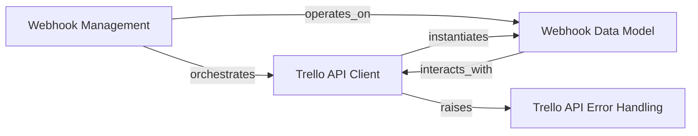

## Component Details

The Webhook Management subsystem facilitates the interaction with Trello's webhook API. It allows users to programmatically list existing webhooks and create new ones to subscribe to Trello events. This functionality is primarily handled by the `Trello API Client` component, which makes the necessary API calls, and the `Webhook Data Model` component, which models individual webhooks and their properties. Error handling during these operations is managed by `Trello API Error Handling`.

### Webhook Management
Orchestrates the listing and creation of Trello webhooks, serving as the primary interface for webhook-related operations.

**Related Classes/Methods**:

- <a href="https://github.com/sarumont/py-trello/blob/master/trello/trelloclient.py#L259-L270" target="_blank" rel="noopener noreferrer">`trello.trelloclient.TrelloClient:list_hooks` (259:270)</a>
- <a href="https://github.com/sarumont/py-trello/blob/master/trello/trelloclient.py#L285-L310" target="_blank" rel="noopener noreferrer">`trello.trelloclient.TrelloClient:create_hook` (285:310)</a>
- <a href="https://github.com/sarumont/py-trello/blob/master/trello/webhook.py#L5-L22" target="_blank" rel="noopener noreferrer">`trello.webhook.WebHook` (5:22)</a>

### Trello API Client
Responsible for all low-level communication with the Trello API, including authentication, sending HTTP requests, and parsing responses, specifically for webhook-related endpoints.

**Related Classes/Methods**:

- <a href="https://github.com/sarumont/py-trello/blob/master/trello/trelloclient.py#L29-L427" target="_blank" rel="noopener noreferrer">`trello.trelloclient.TrelloClient` (29:427)</a>
- <a href="https://github.com/sarumont/py-trello/blob/master/trello/trelloclient.py#L201-L257" target="_blank" rel="noopener noreferrer">`trello.trelloclient.TrelloClient:fetch_json` (201:257)</a>

### Webhook Data Model
Represents the structure and behavior of a single Trello webhook, including its attributes and the ability to delete itself via the API.

**Related Classes/Methods**:

- <a href="https://github.com/sarumont/py-trello/blob/master/trello/webhook.py#L5-L22" target="_blank" rel="noopener noreferrer">`trello.webhook.WebHook` (5:22)</a>
- <a href="https://github.com/sarumont/py-trello/blob/master/trello/webhook.py#L18-L22" target="_blank" rel="noopener noreferrer">`trello.webhook.WebHook:delete` (18:22)</a>

### Trello API Error Handling
Provides specific exception types to signal various error conditions that can occur during Trello API interactions, ensuring robust error management.

**Related Classes/Methods**:

- <a href="https://github.com/sarumont/py-trello/blob/master/trello/exceptions.py#L20-L21" target="_blank" rel="noopener noreferrer">`trello.exceptions.TokenError` (20:21)</a>
- <a href="https://github.com/sarumont/py-trello/blob/master/trello/exceptions.py#L4-L13" target="_blank" rel="noopener noreferrer">`trello.exceptions.ResourceUnavailable` (4:13)</a>
- <a href="https://github.com/sarumont/py-trello/blob/master/trello/exceptions.py#L16-L17" target="_blank" rel="noopener noreferrer">`trello.exceptions.Unauthorized` (16:17)</a>

### [FAQ](https://github.com/CodeBoarding/GeneratedOnBoardings/tree/main?tab=readme-ov-file#faq)