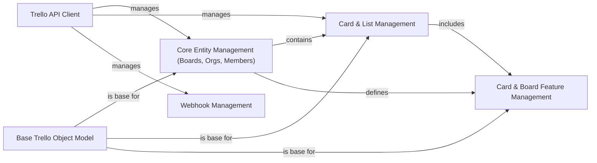

## Component Details

The `py-trello` library provides a Pythonic interface for interacting with the Trello API. Its main purpose is to allow developers to programmatically manage Trello boards, cards, lists, members, organizations, and various card/board features like custom fields, checklists, and labels. The core flow involves authenticating with the Trello API via a client, which then facilitates operations on different Trello entities, often leveraging a base object model for consistency and managing specific features through dedicated components.

### Trello API Client
The central component for authenticating with the Trello API, making HTTP requests, handling responses, and managing general API interactions, including utility functions for user agent generation and handling API-specific exceptions.

**Related Classes/Methods**:

- <a href="https://github.com/sarumont/py-trello/blob/master/trello/trelloclient.py#L29-L427" target="_blank" rel="noopener noreferrer">`py-trello.trello.trelloclient.TrelloClient` (29:427)</a>
- <a href="https://github.com/sarumont/py-trello/blob/master/trello/util.py#L7-L12" target="_blank" rel="noopener noreferrer">`trello.util.generate_user_agent` (7:12)</a>
- <a href="https://github.com/sarumont/py-trello/blob/master/trello/util.py#L15-L96" target="_blank" rel="noopener noreferrer">`trello.util.create_oauth_token` (15:96)</a>
- <a href="https://github.com/sarumont/py-trello/blob/master/trello/exceptions.py#L16-L17" target="_blank" rel="noopener noreferrer">`trello.exceptions.Unauthorized` (16:17)</a>
- <a href="https://github.com/sarumont/py-trello/blob/master/trello/exceptions.py#L4-L13" target="_blank" rel="noopener noreferrer">`trello.exceptions.ResourceUnavailable` (4:13)</a>
- <a href="https://github.com/sarumont/py-trello/blob/master/trello/exceptions.py#L20-L21" target="_blank" rel="noopener noreferrer">`trello.exceptions.TokenError` (20:21)</a>

### Base Trello Object Model
A foundational component providing common attributes and methods inherited by most Trello entity classes, ensuring consistent initialization and basic functionalities across different Trello objects.

**Related Classes/Methods**:

- <a href="https://github.com/sarumont/py-trello/blob/master/trello/base.py#L4-L15" target="_blank" rel="noopener noreferrer">`trello.base.TrelloBase` (4:15)</a>

### Core Entity Management (Boards, Orgs, Members)
Manages high-level Trello entities such as boards, organizations, and members, including operations for retrieving, creating, and updating their details, and listing their associated components.

**Related Classes/Methods**:

- <a href="https://github.com/sarumont/py-trello/blob/master/trello/board.py#L15-L649" target="_blank" rel="noopener noreferrer">`py-trello.trello.board.Board` (15:649)</a>
- <a href="https://github.com/sarumont/py-trello/blob/master/trello/organization.py#L9-L94" target="_blank" rel="noopener noreferrer">`py-trello.trello.organization.Organization` (9:94)</a>
- <a href="https://github.com/sarumont/py-trello/blob/master/trello/member.py#L8-L91" target="_blank" rel="noopener noreferrer">`py-trello.trello.member.Member` (8:91)</a>
- <a href="https://github.com/sarumont/py-trello/blob/master/trello/star.py#L8-L40" target="_blank" rel="noopener noreferrer">`py-trello.trello.star.Star` (8:40)</a>

### Card & List Management
Handles the management of Trello cards and lists. This includes operations for fetching card details, managing attachments, checklists, comments, and custom fields on cards, as well as retrieving and adding cards within lists.

**Related Classes/Methods**:

- <a href="https://github.com/sarumont/py-trello/blob/master/trello/card.py#L19-L819" target="_blank" rel="noopener noreferrer">`py-trello.trello.card.Card` (19:819)</a>
- <a href="https://github.com/sarumont/py-trello/blob/master/trello/trellolist.py#L8-L230" target="_blank" rel="noopener noreferrer">`py-trello.trello.trellolist.List` (8:230)</a>

### Card & Board Feature Management
Provides functionalities for managing various features associated with Trello cards and boards, such as custom fields (definitions and values), checklists, labels, attachments, and power-ups.

**Related Classes/Methods**:

- <a href="https://github.com/sarumont/py-trello/blob/master/trello/customfield.py#L14-L53" target="_blank" rel="noopener noreferrer">`py-trello.trello.customfield.CustomFieldDefinition` (14:53)</a>
- <a href="https://github.com/sarumont/py-trello/blob/master/trello/customfield.py#L56-L132" target="_blank" rel="noopener noreferrer">`py-trello.trello.customfield.CustomField` (56:132)</a>
- <a href="https://github.com/sarumont/py-trello/blob/master/trello/customfield.py#L135-L176" target="_blank" rel="noopener noreferrer">`py-trello.trello.customfield.CustomFieldText` (135:176)</a>
- <a href="https://github.com/sarumont/py-trello/blob/master/trello/customfield.py#L179-L217" target="_blank" rel="noopener noreferrer">`py-trello.trello.customfield.CustomFieldCheckbox` (179:217)</a>
- <a href="https://github.com/sarumont/py-trello/blob/master/trello/customfield.py#L220-L260" target="_blank" rel="noopener noreferrer">`py-trello.trello.customfield.CustomFieldDate` (220:260)</a>
- <a href="https://github.com/sarumont/py-trello/blob/master/trello/customfield.py#L263-L318" target="_blank" rel="noopener noreferrer">`py-trello.trello.customfield.CustomFieldList` (263:318)</a>
- <a href="https://github.com/sarumont/py-trello/blob/master/trello/customfield.py#L321-L359" target="_blank" rel="noopener noreferrer">`py-trello.trello.customfield.CustomFieldNumber` (321:359)</a>
- <a href="https://github.com/sarumont/py-trello/blob/master/trello/checklist.py#L8-L184" target="_blank" rel="noopener noreferrer">`py-trello.trello.checklist.Checklist` (8:184)</a>
- <a href="https://github.com/sarumont/py-trello/blob/master/trello/label.py#L8-L45" target="_blank" rel="noopener noreferrer">`py-trello.trello.label.Label` (8:45)</a>
- <a href="https://github.com/sarumont/py-trello/blob/master/trello/attachments.py#L7-L40" target="_blank" rel="noopener noreferrer">`py-trello.trello.attachments.Attachments` (7:40)</a>
- <a href="https://github.com/sarumont/py-trello/blob/master/trello/attachments.py#L43-L62" target="_blank" rel="noopener noreferrer">`py-trello.trello.attachments.AttachmentsPreview` (43:62)</a>
- <a href="https://github.com/sarumont/py-trello/blob/master/trello/powerup.py#L15-L63" target="_blank" rel="noopener noreferrer">`py-trello.trello.powerup.PowerUp` (15:63)</a>

### Webhook Management
Dedicated component for managing Trello webhooks, allowing users to list existing webhooks and create new ones to receive notifications about Trello events.

**Related Classes/Methods**:

- <a href="https://github.com/sarumont/py-trello/blob/master/trello/webhook.py#L5-L22" target="_blank" rel="noopener noreferrer">`trello.webhook.WebHook` (5:22)</a>

### [FAQ](https://github.com/CodeBoarding/GeneratedOnBoardings/tree/main?tab=readme-ov-file#faq)